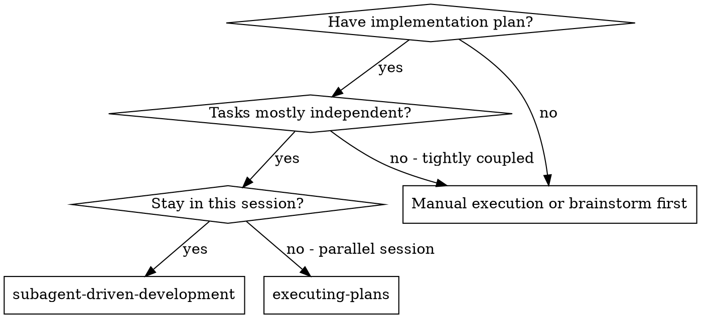
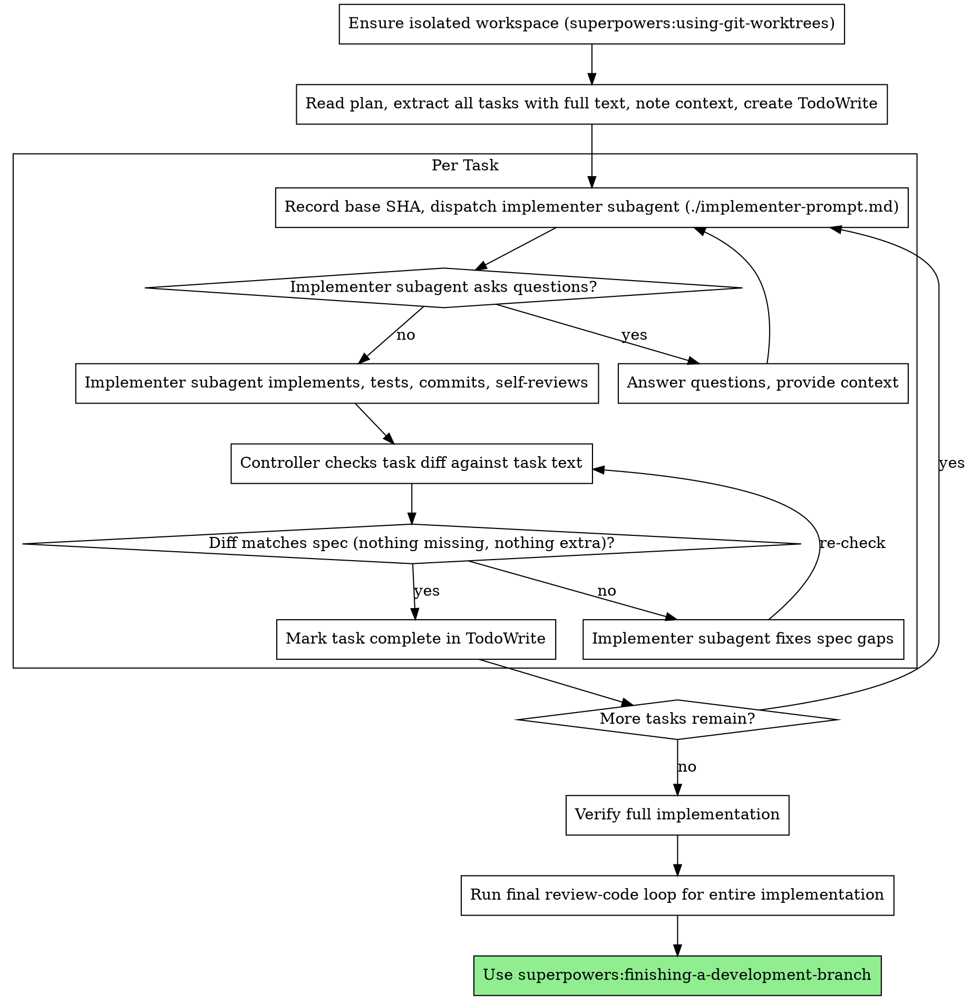

# Subagent-Driven Development

Execute plan by dispatching fresh subagent per task; the controller checks each task's diff against its spec, then runs one full code review loop at the end.

**Why subagents:** You delegate tasks to specialized agents with isolated context. By precisely crafting their instructions and context, you ensure they stay focused and succeed at their task. They should never inherit your session's context or history — you construct exactly what they need. This also preserves your own context for coordination work.

**Core principle:** Fresh subagent per task + controller spec check per task + one full review loop at the end = high quality, fast iteration

**Narration:** between tool calls, narrate at most one short line — the
ledger and the tool results carry the record.

**Continuous execution:** Do not pause to check in with your human partner between tasks. Execute all tasks from the plan without stopping. The only reasons to stop are: BLOCKED status you cannot resolve, ambiguity that genuinely prevents progress, or all tasks complete. "Should I continue?" prompts and progress summaries waste their time — they asked you to execute the plan, so execute it.

## When to Use



**vs. Executing Plans (parallel session):**
- Same session (no context switch)
- Fresh subagent per task (no context pollution)
- Controller spec check after each task; one full review-code loop at the end
- Faster iteration (no human-in-loop between tasks)

## The Process

**Task tracker:** wherever this skill says TodoWrite, use the harness's task
tracker — TodoWrite in Claude Code, `update_plan` in Codex, or the equivalent;
when the harness has none, the Durable Progress ledger alone is the tracker.



## Pre-Flight Plan Review

Before dispatching Task 1, scan the plan once for conflicts:

- tasks that contradict each other or the plan's Global Constraints
- anything the plan explicitly mandates that the review rubric treats as a
  defect (a test that asserts nothing, verbatim duplication of a logic block)

Present everything you find to your human partner as one batched question —
each finding beside the plan text that mandates it, asking which governs —
before execution begins, not one interrupt per discovery mid-plan. If the
scan is clean, proceed without comment. The review loop remains the net for
conflicts that only emerge from implementation.

## Review Routing

**Per task — controller spec check, no reviewer subagent.** After the
implementer reports DONE, read the task's diff (`git diff <base>..<head>`,
using the base SHA recorded before dispatch) against the task text: every
requirement present, tests written as specified, nothing extra built. Do this
yourself, inline — do not dispatch a reviewer subagent for it, and do not
judge code quality here. Spec drift compounds: a task that misreads the plan
becomes the foundation the next tasks build on, so it must be caught while it
is one task wide. Quality (consolidation, duplication across tasks,
architectural fit) is a whole-branch property that a single task's diff cannot
show — it waits for the final review.

If the diff doesn't match the task text, send the specific gaps back to the
implementer and re-check after the fix.

Before marking the task complete, also run `git status --short`: the worktree
must be clean. Staged or unstaged leftovers are work the spec check never saw —
send them back to the implementer to commit or drop.

Do not use `review-code`, `review-plan`, or `review-spec` for every task. Those
review skills are full-artifact reviews and are too heavy for per-task gates.

**After all tasks — one full review loop.** Run one full read-only
implementation review with the `review-code` skill. Before starting
that review, the controller must verify the full implementation or record the
exact verification blocker and pass only the current evidence/blocker summary to
the reviewer.

**If running in Codex:** run the OpenCode wrapper outside the Codex sandbox.

```bash
opencode-review-code <target> [against <plan-or-requirements>]
```

**If running in OpenCode:** run the Codex wrapper.

```bash
codex-review-code <target> [against <plan-or-requirements>]
```

The reviewer is advisory. The controller decides whether each comment is valid,
explains any rejected feedback, and sends only valid fixes back to the
implementer. review-code is evidence-only; it inspects existing evidence and is
not responsible for running deterministic checks. It must not run lint,
typecheck, build, tests, coverage, snapshots, generated artifacts, services,
migrations, or cleanup. The implementer must already have run the task's
required verification before review starts, and the controller must run or
record full implementation verification before final review.

**Final review loop:** Follow `workflow-policy` for interactive implementation
sessions: `review-code`, using the applicable review/address iteration cap,
stop on `Verdict: Approve` or when no accepted improvements remain. Adjudicate
all findings, including accepted Nit and low-level findings. Apply valid
feedback, explain rejected feedback briefly, run verification after accepted fixes, and never run reviews back-to-back without addressing accepted findings.

If the opposite harness or target model is unavailable, use `review-code` in
the current harness/model and note the fallback in the task report.

## Model Selection

Route model/tier choice through the delegation policy when one exists (the
`delegation-triage` skill resolves `~/.config/agent-rules/delegation-policy.yaml`):
it decides which tier — and which harness — handles each kind of work, and it
routes cheap/bulk implementation through opencode rather than native
cheap-model subagents (this environment hard-denies `sonnet`/`haiku` native
dispatch). Resolve routes once, before the first dispatch — read the policy and
note the implementer and reviewer routes for the session. The resolved policy
is authoritative; the tier guidance below applies only where the policy is
silent or absent.

Use the least powerful tier that can handle each role to conserve cost and
increase speed. A tier is a route, not necessarily a native subagent: where a
policy routes cheap tiers to another harness, following this guidance never
means dispatching a native subagent on a cheap model.

**Mechanical implementation tasks** (isolated functions, clear specs, 1-2 files): route to the cheap tier. Most implementation tasks are mechanical when the plan is well-specified.

**Integration and judgment tasks** (multi-file coordination, pattern matching, debugging): route to the standard tier.

**Architecture, design, and review tasks**: use the most capable available tier.

Cross-harness review routing overrides the normal tier choice for reviewer
roles.

**Make the tier choice explicit before every dispatch.** An unconsidered
dispatch inherits your session's model — often the most capable and most
expensive — which silently defeats this section. Explicit means naming the
resolved route: the policy's harness for cheap tiers, or a deliberately
chosen (or deliberately inherited) model for native dispatches.

**Turn count beats token price.** Wall-clock and context cost scale with how
many turns a subagent takes, and the cheapest models routinely take 2-3× the
turns on multi-step work — costing more overall. Use the standard tier as the
floor for implementers working from prose descriptions. When the task's plan
text contains the complete code to write, the implementation is transcription
plus testing: use the cheapest tier for that implementer. Single-file
mechanical fixes also take the cheapest tier.

**Task complexity signals:**
- Touches 1-2 files with a complete spec → cheap tier
- Touches multiple files with integration concerns → standard tier
- Requires design judgment or broad codebase understanding → most capable tier

## Handling Implementer Status

Implementer subagents report one of four statuses. Handle each appropriately:

**DONE:** Proceed to the spec check.

**DONE_WITH_CONCERNS:** The implementer completed the work but flagged doubts. Read the concerns before proceeding. If the concerns are about correctness or scope, address them before the spec check. If they're observations (e.g., "this file is getting large"), note them and proceed to the spec check.

**NEEDS_CONTEXT:** The implementer needs information that wasn't provided. Provide the missing context and re-dispatch.

**BLOCKED:** The implementer cannot complete the task. Assess the blocker:
1. If it's a context problem, provide more context and re-dispatch with the same model
2. If the task requires more reasoning, re-dispatch with a more capable model
3. If the task is too large, break it into smaller pieces
4. If the plan itself is wrong, escalate to the human

**Never** ignore an escalation or force the same model to retry without changes. If the implementer said it's stuck, something needs to change.

## Durable Progress

Conversation memory does not survive compaction. In real sessions, controllers
that lost their place have re-dispatched entire completed task sequences — the
single most expensive failure observed. Track progress in a ledger file, not
only in todos.

- At skill start, check for a ledger:
  `cat "$(git rev-parse --show-toplevel)/.superpowers/sdd/progress.md"`. A
  missing ledger is normal — it means no tasks are complete yet; create the
  directory before the first append
  (`mkdir -p "$(git rev-parse --show-toplevel)/.superpowers/sdd"`). Tasks
  listed there as complete are DONE — do not re-dispatch them; resume at the
  first task not marked complete.
- When a task's spec check passes, append one line to the ledger in the
  same message as your other bookkeeping:
  `Task N: complete (commits <base7>..<head7>, spec check clean)`.
- The ledger is your recovery map: the commits it names exist in git even when
  your context no longer remembers creating them. After compaction, trust the
  ledger and `git log` over your own recollection.
- `git clean -fdx` will destroy the ledger (it's git-ignored scratch); if that
  happens, recover from `git log`.

## Prompt Templates

- `./implementer-prompt.md` - Dispatch implementer subagent

## Example Workflow

```
You: I'm using Subagent-Driven Development to execute this plan.

[Ensure isolated workspace (worktree)]
[Read plan file once: PLAN.md]
[Extract all 5 tasks with full text and context]
[Create task tracker entries for all 5 tasks]

Task 1: Hook installation script

[Record base SHA]
[Get Task 1 text and context (already extracted)]
[Dispatch implementation subagent with full task text + context]

Implementer: "Before I begin - should the hook be installed at user or system level?"

You: "User level (~/.config/superpowers/hooks/)"

Implementer: "Got it. Implementing now..."
[Later] Implementer:
  - Implemented install-hook command
  - Added tests, 5/5 passing
  - Self-review: Found I missed --force flag, added it
  - Committed

[Spec check: git diff <base>..<head> against Task 1 text]
✅ All requirements present, tests included, nothing extra

[Mark Task 1 complete, append to ledger]

Task 2: Recovery modes

[Record base SHA]
[Get Task 2 text and context (already extracted)]
[Dispatch implementation subagent with full task text + context]

Implementer: [No questions, proceeds]
Implementer:
  - Added verify/repair modes
  - 8/8 tests passing
  - Self-review: All good
  - Committed

[Spec check: git diff <base>..<head> against Task 2 text]
❌ Gaps:
  - Missing: Progress reporting (spec says "report every 100 items")
  - Extra: Added --json flag (not requested)

[Dispatch implementer to fix the specific gaps]
Implementer: Removed --json flag, added progress reporting

[Re-check diff]
✅ Matches spec now

[Mark Task 2 complete, append to ledger]

...

[After all tasks]
[Verify full implementation]
[Run final review-code loop]
Final reviewer: Issues (Important): Magic number (100) in progress reporting

[Dispatch implementer to fix]
Implementer: Extracted PROGRESS_INTERVAL constant

[Verify, re-run review-code]
Final reviewer: Verdict: Approve

Done!
```

## Advantages

**vs. Manual execution:**
- Subagents follow TDD naturally
- Fresh context per task (no confusion)
- Parallel-safe (subagents don't interfere)
- Subagent can ask questions (before AND during work)

**vs. Executing Plans:**
- Same session (no handoff)
- Continuous progress (no waiting)
- Review checkpoints automatic

**Efficiency gains:**
- No file reading overhead (controller provides full text)
- Controller curates exactly what context is needed
- Subagent gets complete information upfront
- Questions surfaced before work begins (not after)

**Quality gates:**
- Self-review catches issues before handoff
- Per-task spec check stops drift before dependent tasks build on it
- Spec check prevents over/under-building
- Final review-code loop judges quality where it's visible: across the whole branch
- Re-checks and re-reviews ensure fixes actually land

**Cost:**
- One implementer subagent per task, plus fix dispatches
- Controller does more prep work (extracting all tasks upfront, checking each diff)
- Final review loop adds iterations
- But catches spec drift early (cheaper than unwinding dependent tasks)

## Red Flags

**Never:**
- Start implementation on main/master branch without explicit user consent
- Skip the per-task spec check or the final review-code loop
- Proceed with unfixed issues
- Dispatch multiple implementation subagents in parallel (conflicts)
- Make subagent read plan file (provide full text instead)
- Skip scene-setting context (subagent needs to understand where task fits)
- Ignore subagent questions (answer before letting them proceed)
- Accept "close enough" on the spec check (gaps found = not done)
- **Defer spec gaps to the final review** (they compound across dependent tasks — fix them per task)
- Let implementer self-review replace the spec check or the final review (all are needed)
- Move to next task while the spec check has open gaps

**If subagent asks questions:**
- Answer clearly and completely
- Provide additional context if needed
- Don't rush them into implementation

**If the spec check or final review finds issues:**
- Implementer subagent fixes them
- Re-check the diff (or re-run the review)
- Repeat until clean
- Don't skip the re-check

**If subagent fails task:**
- Dispatch fix subagent with specific instructions
- Don't try to fix manually (context pollution)

## Integration

**Required workflow skills:**
- **superpowers:using-git-worktrees** - Ensures isolated workspace (creates one or verifies existing)
- **writing-plans** - Creates the plan this skill executes
- **review-code** - Read-only implementation review (cross-harness)
- **workflow-policy** - Review-loop iteration caps and controller boundaries
- **delegation-triage** - Resolves the delegation policy for model/harness routing
- **superpowers:finishing-a-development-branch** - Complete development after all tasks

**Subagents should use:**
- **superpowers:test-driven-development** - Subagents follow TDD for each task

**Alternative workflow:**
- **superpowers:executing-plans** - Use for parallel session instead of same-session execution
